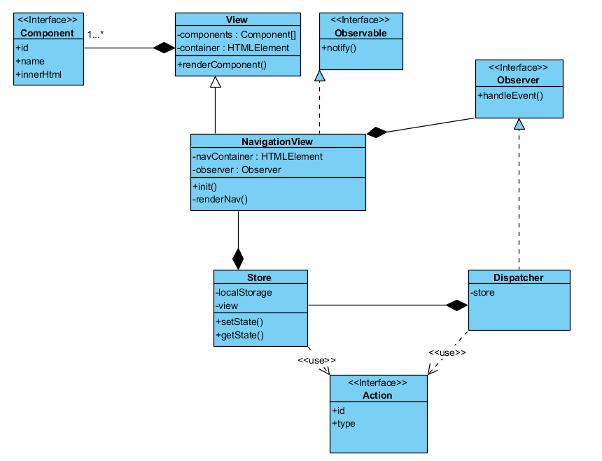

# Типизация

## Как запустить:

- для запуска скопилированного проекта

`npm run start` 

- для компиляции

`npm run tsc`
`npm run bundle`

Самой большой проблемой с typescript был обход предупреждения на null в функциях вроде querySelector, из за этого код увеличился из-за огромного количества проверок, наверное поэтому ts лучше не использовать вне ангуляра, в котором таких проблем не возникает.

#Архитектура

## Как запустить:

`npm i` 
`npm run start` 

Классовая диаграмма системы, все публичные методы - API, система связана с данным проектом с помощью класса NavigationView, 
в котором хранится информация для рендеринга конкретных компонентов страницы

